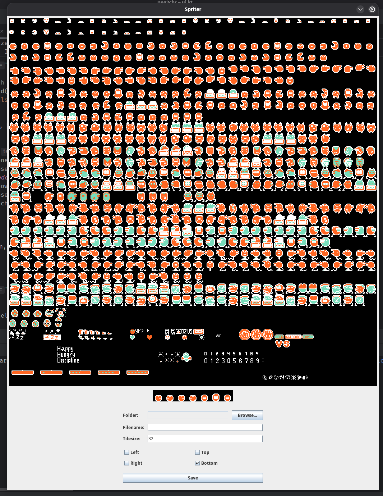

# CHR Spritesheet Builder

This is a **Kotlin (Java-based)** graphical application for creating **CHR spritesheets** from a single resource file. The tool provides a user-friendly interface to prepare NES-compatible graphics assets with fine control over positioning, palettes, and arrangement.

---

## ✨ Features

✅ **Convert resource selections into CHR sprites**

* Choose specific sprite regions to export as CHR tiles.

✅ **Adjust centering and alignment**

* Modify the centering of each sprite to ensure consistent placement in your target engine.

✅ **Custom ordered spritesheet construction**

* Reorder and organize your selected sprites exactly as you need them in the final sheet.

✅ **Palette management**

* Assign and preview different palettes for each sprite or group of sprites.

---

## 🖥️ How to Use

1. **Launch the application**

    * Run the Kotlin JAR or start via your IDE.

2. **Load your resource**

    * Select the source file containing your sprites.

3. **Select sprites**

    * Use the selection tools to pick individual tiles or regions.

4. **Adjust centering**

    * Set custom offsets to center your sprites as required.

5. **Arrange spritesheets**

    * Drag and order your selections to build your final sheet.

6. **Configure palettes**

    * Choose among different palettes and preview the result.

7. **Export**

    * Generate the CHR spritesheet file for use in your project.

---

## 🛠️ Requirements

* **Java 11** or newer
* **Kotlin 1.8+**
* Works on Windows, macOS, and Linux

---

## 🚀 Building

Open in IntelliJ IDEA and build from the IDE.

---

## 📄 License

MIT License.

